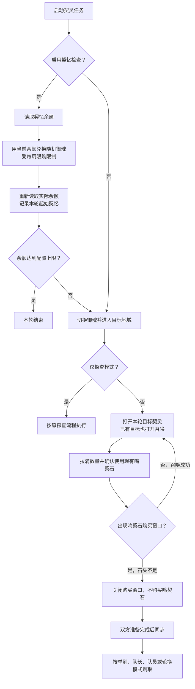

# 契灵准备流程与立即停止（0.4.8）

契灵结契任务现在先完成双方各自的资源准备，再进入原有的邀请与轮换流程。

- 队长、队员和两种轮换身份都走相同准备流程；仅探查模式不消耗鸣契石。
- 契忆上限保持原有语义：在本轮开始时，按兑换后的实际余额判断；不是本轮新增契忆，也没有新增逐战返回商城检查。
- 兑换只买随机御魂，每个 20 契忆；选择数量不超过可负担数量、单次上限和周限购。兑换价格、数量与余额变化都必须核验，失败不盲目重复付款。
- 每轮开始使用现有鸣契石召唤，不受旧版“无目标时才使用契石”的开关影响。旧配置字段保留兼容，不再显示无效开关。
- 游戏购买弹窗只是石头不足的退出信号。识别失败、确认目标不符或页面卡住会限时退出并稍后重试，不把未知状态当作石头为零。
- 保留原有战斗次数、运行时间、邀请、轮换和结契设置。本次没有重写计数或队长交接协议。

## 用户手动停止

运行中点击电源按钮或右上角停止按钮，立即结束脚本进程，不等待战斗结束或返回庭院，也不操作游戏退出战斗。游戏内战斗、自动战斗本身由游戏继续控制，用户可立即手动接管。

后端确认进程真正退出后，才回报停止；本轮未完成记录为“中断”，不记成功，也不自动重跑。下一次点击启动会创建新执行器。异常状态的“重新运行”语义保持不变。

“暂停”仍表示等待当前可暂停任务段结束后保留进程，按钮说明明确提示需要立即接管时点击电源。旧版非协作任务可能要等整轮结束，不能把暂停当成立即停止。

## 验证范围

离线状态机测试覆盖余额不足、周限购、兑换后基线、价格不符、付款响应不明、目标已存在、零鸣契石、多批召唤、错误目标与识别超时；五种身份均验证准备在同步之前完成。

停止测试覆盖真实生命周期的退出确认、未完成记录关闭、另一配置隔离、可重新启动和前端单击发出立即停止请求。识别回放使用用户提供的召唤、确认和缺货截图；不会为测试自动启动真实游戏任务或消耗游戏资源。
