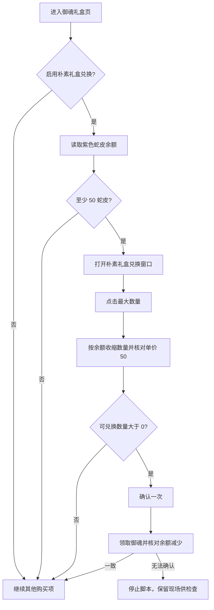

# 大富翁：朴素御魂礼盒兑换

按 2026-09-26 的操作说明，每次大富翁任务进入秘卷书童的御魂礼盒页面后，点击朴素礼盒兑换、选择最大数量，再确认一批。完成后继续其他已启用的购买项，不再循环买空余额。

配置中的「兑换朴素御魂礼盒」改为勾选框。旧数值 0 读取为关闭，正数读取为开启；「御魂礼盒」分组总开关仍然有效。既有的首领御魂、海国御魂设置不受影响。

不再依赖卡片上的旧版「本周剩余数量」OCR。数量由兑换窗口的最大值与实际余额共同限制，数量、金额和余额均需连续两次读数一致。余额区域避开蛇皮图标，修复图标被读为前导数字 1 的问题。窗口识别、提交和结果等待都有超时；提交后不会再次点击支付按钮。

附带修正：推送测试使用单层可滚动弹窗，标签与输入框分开；百鬼夜行独立任务的执行器、配置、入口、翻译和专用资源已删除。旧配置里的百鬼夜行不会被调度，其遗留运行标记会被忽略。限时活动中的「百鬼夜行图上色」属于另一个功能，继续保留。

验证包含游戏状态回放、原始截图的 OCR / 模板匹配、旧配置兼容，以及标准与放大字号下的弹窗排版。未使用真实推送配置发送消息；完整游戏兑换仍需实机验收。
